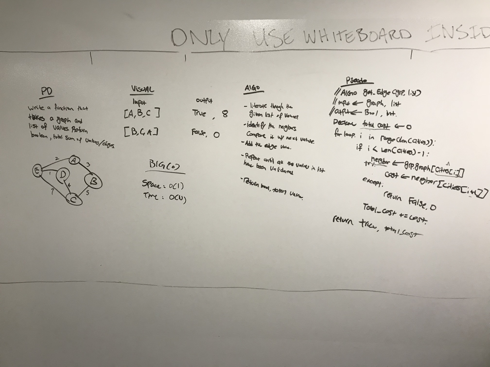

# Get Edge

## Summary
- Given a graph and list of values, validate a if values are directly connected within the graph. If so, return the total amount of edges and boolean(true), else, return zero and edge and boolean(false).

## Whiteboard

