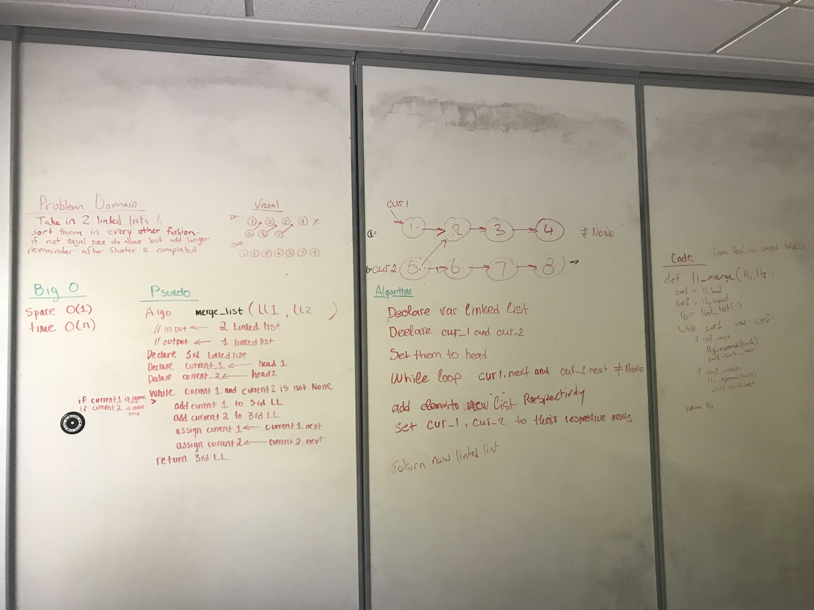

# Merge Linked List

## Summery
- Write a function that takes two linked lists as arguements, zip the two linked list into one so that nodes alternate between two lists, and return the one merged linked list.

## Whiteboard

