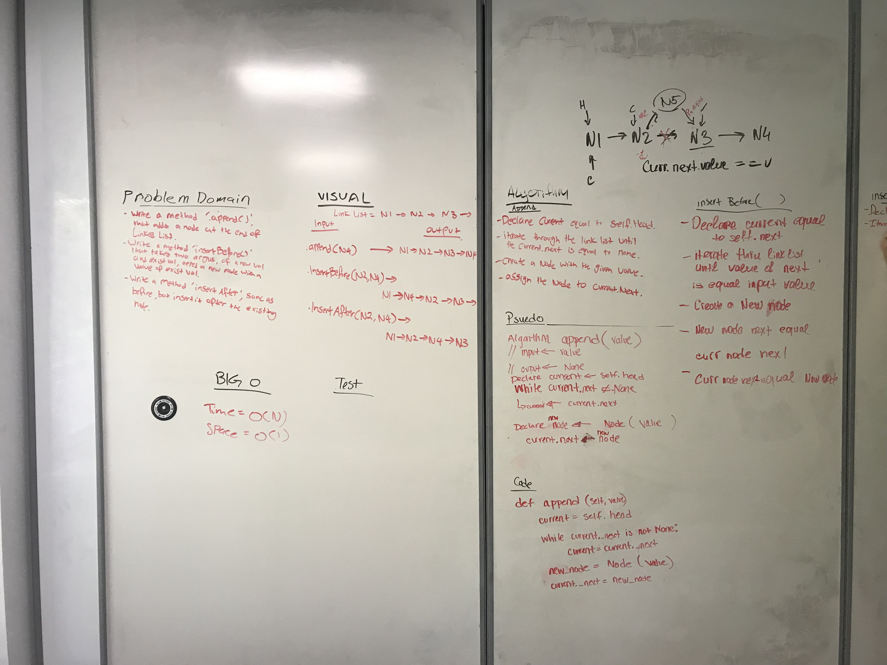

# Linked List

## Summary
- Implemented Node and Linked List abstract classes in python 3.

### Node
- Holdes the attributes of `val` and `_next`

### Linked List
- Implement insert(), when method gets called with an argument of an integer, a new Node gets created and attached in the head of linked list.
- Implemented includes(), when method gets called with an argument of an integer, it will iterate through the linked list to find the input integer equal to the Node value within the linked list and return a boolean.
- Implement constructor that has an option to take a list of integer. Then it will create a Nodes with the values included in the list and insert it into the linked list.
- Implement `append(value)`, which takes an argument of a value, create a new Node and append it at the end of the Linked List.
- Implement `insertBefore(value, newValue)`, that takes two argument of an existing value and a new value. It will iterate and find a Node that holds the existing value, and create a new Node with a value of a new value and insert it before the Node with existing value.
- Implement `insertAfter(value, new Value)`, this will do the same action as `insertBefore`, but the new Node will insert it after the Node with existing value.

## Whiteboard

