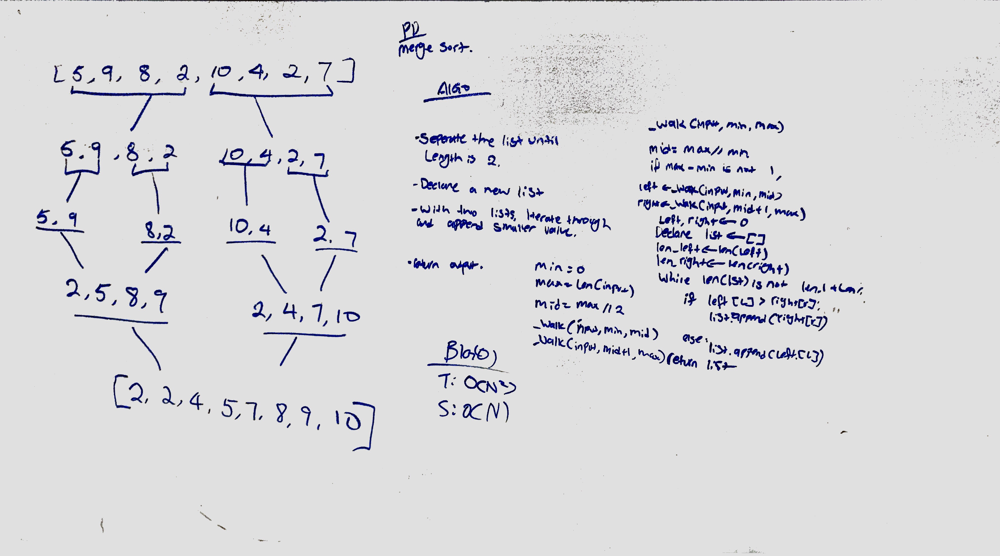

# Merge Sort

## Process
1. divide the list until length of each list is less or equal to 2.
1. Start merging those individual lists,
1. As lists are getting merged, sort the values in a numerical order.
1. Merge all lists into one as all the values are being sorted
1. Return the sorted list of values.

Big(O) of n log n

## Whiteboard

