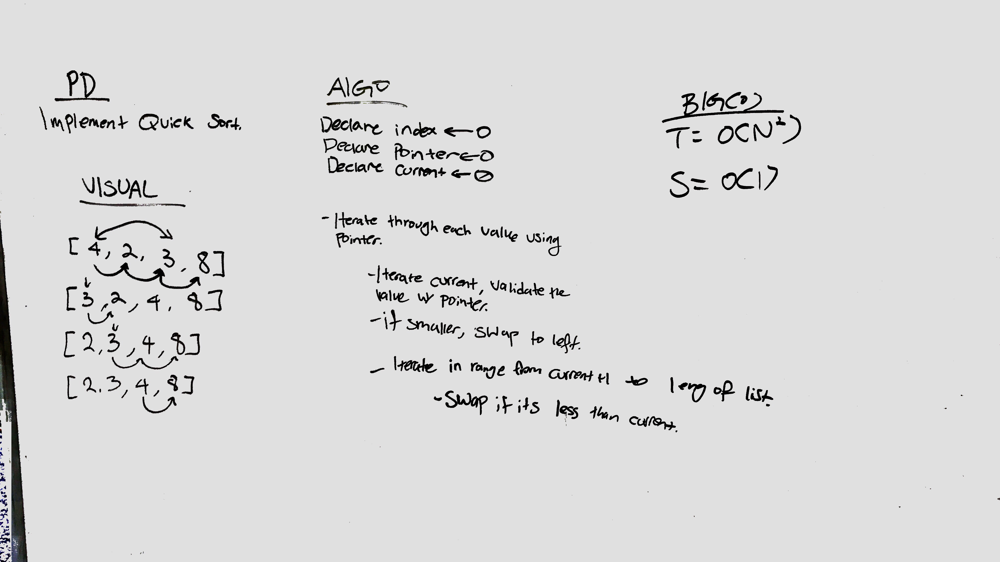

# Quick Sort

## Summary
1. Set the Pivot to a first element,
1. Reorder the list so that all elements with values less than the pivot come before the pivot,
1. while all elements with values greater than the pivot come after it.
1. Apply the above steps to the all the elements within the list

