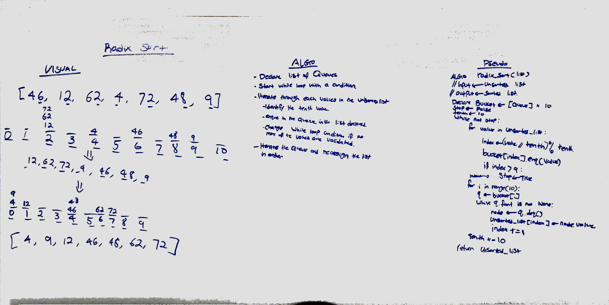

# Radix Sort

## Summary
Implementation of Radix sort.
    - Iterate through each digits in the values and sort them by the size of selected digit
    - Resort back to a list in a order of placement with digits
    - Continue until all the digits

## Whiteboard

